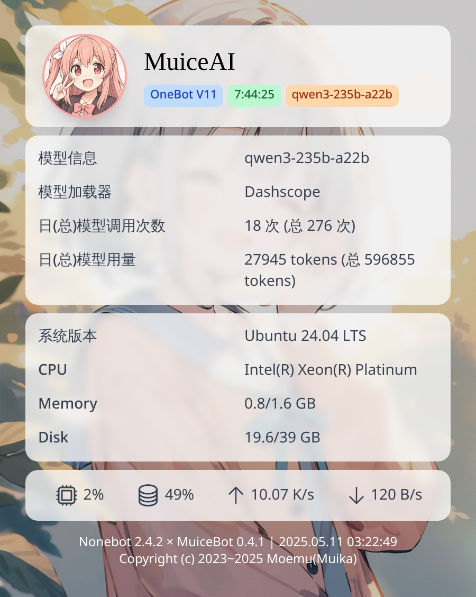

  
  <h1 align="center">MuiceBot-Plugin-Status</h1>
  
基于 nonebot_plugin_htmlrender 的 Muicebot 状态插件

  
  
  

    
效果示例

	

## 使用方式

使用 `.status` 或 `/status` 即可

## 配置项

### status__avatar_url

- 说明: bot 图像链接

- 类型: str

- 默认值: https://s2.loli.net/2025/04/20/oK6pncNCeWfIyE3.jpg

### status__backgroud_url

- 说明: 背景图片链接

- 类型: str

- 默认值: https://s2.loli.net/2025/04/20/nYN2kbs38Xc6zBj.jpg

### status__nickname

- 说明: 机器人昵称

- 类型: str

- 默认值: MuikaAI

### status__priority

- 说明: 指令优先级

- 类型: int

- 默认值: 5

## 注意

模板文件中使用了 `tailwindcss` 的 CDN 实现，而官方并不推荐这种方法且存在获取问题。

我们以后可能会更改有关实现，也欢迎您提交 PR 来帮助我们更改这个功能！